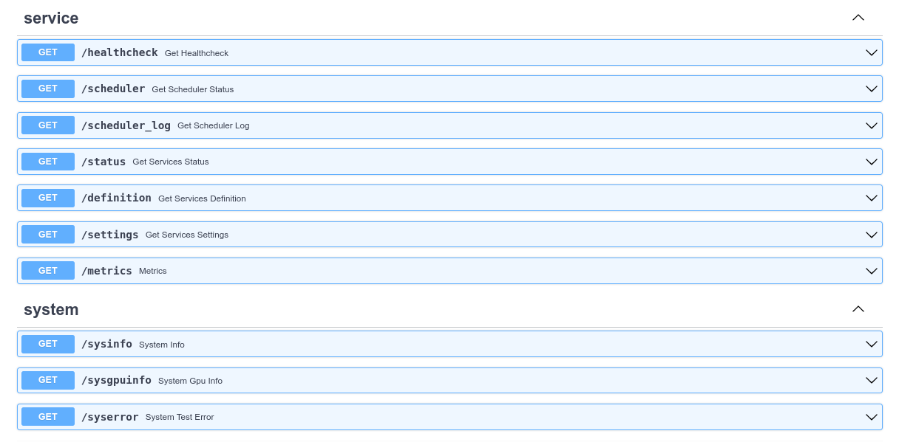

## Example Usage of MSAApp

??? note "MSAApp Service Definition Settings"
    ```python
    {!./msaSDK/models/service.py[ln:25-164]!}
    ```

## Minimal Example
```python
{!./docs_src/examples/app_minimal.py!}
```


## With CRUD/SQLModels and Scheduler
```python
{!./docs_src/examples/app_crud_sqlmodel_scheduler.py!}
```

## System and Service API routes (Optional)
Turning on the MSAApp settings ``sysrouter``and ``servicerouter``then you also get the following routes:

