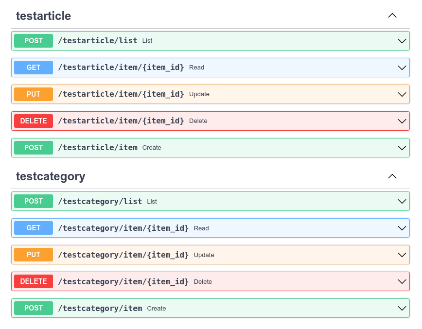

Required MSAApp Service Definition (Settings):

    sqlite_db_crud: bool = True

### Example Usage of MSAApp.utils.crud

```python
{!./docs_src/examples/crud_first.py!}
```


### Here the API routes you get from this:
