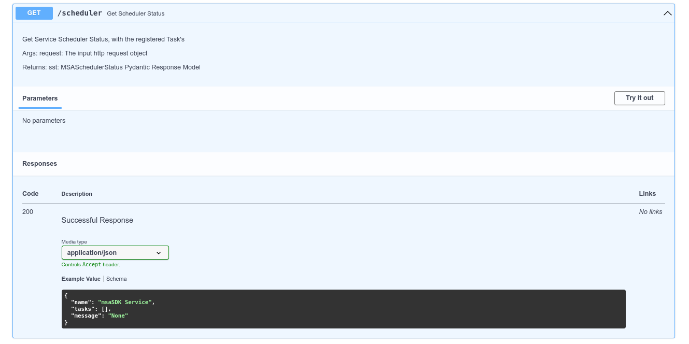
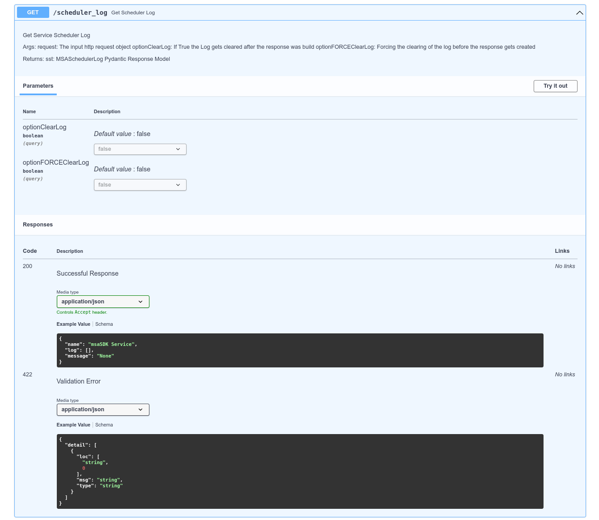

Required MSAApp Service Definition (Settings):

    scheduler: bool = True
    
    # Optional
    scheduler_debug: bool = False


??? example "Examples of Scheduler Task interval"
    ```python
    # Execution on fixed time interval
    app.scheduler.task("hourly")
    app.scheduler.task("daily between 22:00 and 23:00")
    app.scheduler.task("weekly before Friday")
    app.scheduler.task("monthly starting 3rd")

    # Fixed time interval
    app.scheduler.task("time of hour before 45:00")
    app.scheduler.task("time of day between 10:00 and 16:00")
    app.scheduler.task("time of week after Monday")
    app.scheduler.task("time of month after 5th")

    # Time delta
    app.scheduler.task("every 1 hour")
    app.scheduler.task("every 30 sec")
    app.scheduler.task("every 2 hours, 30 minutes")
    app.scheduler.task("every 1 day, 12 hour, 30 min, 20 sec")

    # Task Status
    app.scheduler.task("has succeeded this hour")
    app.scheduler.task("has failed today between 08:00 and 16:00")
    app.scheduler.task("has started this week before Friday")
    app.scheduler.task("has terminated this month after 6th")
    app.scheduler.task("has succeeded past 2 hours, 30 minutes")

    # Task Dependence
    app.scheduler.task("after task 'a_task'")
    app.scheduler.task("after task 'a_task' succeeded")
    app.scheduler.task("after task 'a_task' failed")
    app.scheduler.task("after task 'a_task' finished")
    app.scheduler.task("after tasks 'a_task', 'another_task' finished")

    ```


```python

from msaSDK.models.service import get_msa_app_settings
from msaSDK.service import MSAApp


async def test_timer_min():
    app.logger.info("msaSDK Test Timer Async Every Minute")


def test_timer_five_sec():
    app.logger.info("msaSDK Test Timer Sync 5 Second")

get_msa_app_settings.cache_clear()
settings = get_msa_app_settings()
settings.title = "u2d.ai - MSA/SDK MVP"
settings.version = "0.0.1"
settings.debug = True

app = MSAApp(settings=settings, 
             contact={"name": "msaSDK", "url": "http://u2d.ai", "email": "stefan@u2d.ai"},
             license_info={"name": "MIT", "url": "https://opensource.org/licenses/MIT", })

app.scheduler.task("every 1 min", func=test_timer_min )
app.scheduler.task("every 5 sec", func=test_timer_five_sec )

app.logger.info("Initialized " + settings.title + " " + settings.version)


if __name__ == '__main__':
    pass
```


### Scheduler API routes (Optional)
Turning on the MSAApp settings ``scheduler``and ``servicerouter``then you also get the following routes:

Get the Scheduler Info:
=== "API"
    

=== "JSON Result Example"
    ```python
    {
      "name": "msaSDK Service",
      "tasks": [
        {
          "name": "test_timer_min",
          "detail": {
            "permanent_task": false,
            "fmt_log_message": "Task '{task}' status: '{action}'",
            "daemon": null,
            "name": "test_timer_min",
            "description": null,
            "logger_name": "rocketry.task",
            "execution": null,
            "priority": 0,
            "disabled": false,
            "force_run": false,
            "force_termination": false,
            "status": "success",
            "timeout": null,
            "parameters": {},
            "start_cond": {
              "task": null,
              "period": {
                "reference": null
              },
              "_comps": {
                "__eq__": 0
              },
              "_str": "every 1 min"
            },
            "end_cond": {},
            "on_startup": false,
            "on_shutdown": false,
            "last_run": "2022-09-17T21:07:10.056788",
            "last_success": "2022-09-17T21:07:10.057056",
            "last_fail": null,
            "last_terminate": null,
            "last_inaction": null,
            "last_crash": null,
            "func": {},
            "path": null,
            "func_name": "main",
            "cache": false,
            "sys_paths": []
          }
        },
        {
          "name": "test_timer_five_sec",
          "detail": {
            "permanent_task": false,
            "fmt_log_message": "Task '{task}' status: '{action}'",
            "daemon": null,
            "name": "test_timer_five_sec",
            "description": null,
            "logger_name": "rocketry.task",
            "execution": null,
            "priority": 0,
            "disabled": false,
            "force_run": false,
            "force_termination": false,
            "status": "success",
            "timeout": null,
            "parameters": {},
            "start_cond": {
              "task": null,
              "period": {
                "reference": null
              },
              "_comps": {
                "__eq__": 0
              },
              "_str": "every 5 sec"
            },
            "end_cond": {},
            "on_startup": false,
            "on_shutdown": false,
            "last_run": "2022-09-17T21:07:30.406631",
            "last_success": "2022-09-17T21:07:30.407052",
            "last_fail": null,
            "last_terminate": null,
            "last_inaction": null,
            "last_crash": null,
            "func": {},
            "path": null,
            "func_name": "main",
            "cache": false,
            "sys_paths": []
          }
        }
      ],
      "message": "Scheduler is enabled!"
    }
    ```

Get and reset (optional) the Scheduler Task's Log:

=== "API"
    

=== "JSON Result Example"
    ```python
    {
      "name": "msaSDK Service",
      "log": [
        {
          "task_name": "test_timer_five_sec",
          "action": "run",
          "created": "2022-09-17T19:11:57.010138+00:00",
          "name": "rocketry.task",
          "msg": "Task 'test_timer_five_sec' status: 'run'",
          "levelname": "INFO",
          "levelno": 20,
          "pathname": "/home/swelcker/msaSDK/venv/lib/python3.9/site-packages/rocketry/core/task.py",
          "filename": "task.py",
          "module": "task",
          "exc_text": null,
          "lineno": 910,
          "funcName": "_set_status",
          "msecs": 10.137557983398438,
          "relativeCreated": "1970-01-15T11:18:40.056200+00:00",
          "thread": 139693989818368,
          "threadName": "MainThread",
          "processName": "MainProcess",
          "process": 893596,
          "message": "Task 'test_timer_five_sec' status: 'run'",
          "formatted_message": "Task 'test_timer_five_sec' status: 'run'"
        },
        {
          "task_name": "test_timer_five_sec",
          "action": "success",
          "created": "2022-09-17T19:11:57.010384+00:00",
          "name": "rocketry.task",
          "msg": "Task 'test_timer_five_sec' status: 'success'",
          "levelname": "INFO",
          "levelno": 20,
          "pathname": "/home/swelcker/msaSDK/venv/lib/python3.9/site-packages/rocketry/core/task.py",
          "filename": "task.py",
          "module": "task",
          "exc_text": null,
          "lineno": 910,
          "funcName": "_set_status",
          "msecs": 10.383844375610352,
          "relativeCreated": "1970-01-15T11:18:40.302486+00:00",
          "thread": 139693989818368,
          "threadName": "MainThread",
          "processName": "MainProcess",
          "process": 893596,
          "message": "Task 'test_timer_five_sec' status: 'success'",
          "formatted_message": "Task 'test_timer_five_sec' status: 'success'"
        },
        {
          "task_name": "test_timer_five_sec",
          "action": "run",
          "created": "2022-09-17T19:12:02.033431+00:00",
          "name": "rocketry.task",
          "msg": "Task 'test_timer_five_sec' status: 'run'",
          "levelname": "INFO",
          "levelno": 20,
          "pathname": "/home/swelcker/msaSDK/venv/lib/python3.9/site-packages/rocketry/core/task.py",
          "filename": "task.py",
          "module": "task",
          "exc_text": null,
          "lineno": 910,
          "funcName": "_set_status",
          "msecs": 33.43081474304199,
          "relativeCreated": "1970-01-15T12:42:23.349457+00:00",
          "thread": 139693989818368,
          "threadName": "MainThread",
          "processName": "MainProcess",
          "process": 893596,
          "message": "Task 'test_timer_five_sec' status: 'run'",
          "formatted_message": "Task 'test_timer_five_sec' status: 'run'"
        },
        {
          "task_name": "test_timer_five_sec",
          "action": "success",
          "created": "2022-09-17T19:12:02.033665+00:00",
          "name": "rocketry.task",
          "msg": "Task 'test_timer_five_sec' status: 'success'",
          "levelname": "INFO",
          "levelno": 20,
          "pathname": "/home/swelcker/msaSDK/venv/lib/python3.9/site-packages/rocketry/core/task.py",
          "filename": "task.py",
          "module": "task",
          "exc_text": null,
          "lineno": 910,
          "funcName": "_set_status",
          "msecs": 33.66518020629883,
          "relativeCreated": "1970-01-15T12:42:23.583822+00:00",
          "thread": 139693989818368,
          "threadName": "MainThread",
          "processName": "MainProcess",
          "process": 893596,
          "message": "Task 'test_timer_five_sec' status: 'success'",
          "formatted_message": "Task 'test_timer_five_sec' status: 'success'"
        },
        {
          "task_name": "test_timer_five_sec",
          "action": "run",
          "created": "2022-09-17T19:12:07.054320+00:00",
          "name": "rocketry.task",
          "msg": "Task 'test_timer_five_sec' status: 'run'",
          "levelname": "INFO",
          "levelno": 20,
          "pathname": "/home/swelcker/msaSDK/venv/lib/python3.9/site-packages/rocketry/core/task.py",
          "filename": "task.py",
          "module": "task",
          "exc_text": null,
          "lineno": 910,
          "funcName": "_set_status",
          "msecs": 54.31985855102539,
          "relativeCreated": "1970-01-15T14:06:04.238501+00:00",
          "thread": 139693989818368,
          "threadName": "MainThread",
          "processName": "MainProcess",
          "process": 893596,
          "message": "Task 'test_timer_five_sec' status: 'run'",
          "formatted_message": "Task 'test_timer_five_sec' status: 'run'"
        },
        {
          "task_name": "test_timer_five_sec",
          "action": "success",
          "created": "2022-09-17T19:12:07.054576+00:00",
          "name": "rocketry.task",
          "msg": "Task 'test_timer_five_sec' status: 'success'",
          "levelname": "INFO",
          "levelno": 20,
          "pathname": "/home/swelcker/msaSDK/venv/lib/python3.9/site-packages/rocketry/core/task.py",
          "filename": "task.py",
          "module": "task",
          "exc_text": null,
          "lineno": 910,
          "funcName": "_set_status",
          "msecs": 54.57615852355957,
          "relativeCreated": "1970-01-15T14:06:04.494801+00:00",
          "thread": 139693989818368,
          "threadName": "MainThread",
          "processName": "MainProcess",
          "process": 893596,
          "message": "Task 'test_timer_five_sec' status: 'success'",
          "formatted_message": "Task 'test_timer_five_sec' status: 'success'"
        }
      ],
      "message": "Scheduler is enabled! Scheduler Log cleared!"
    }
    ```