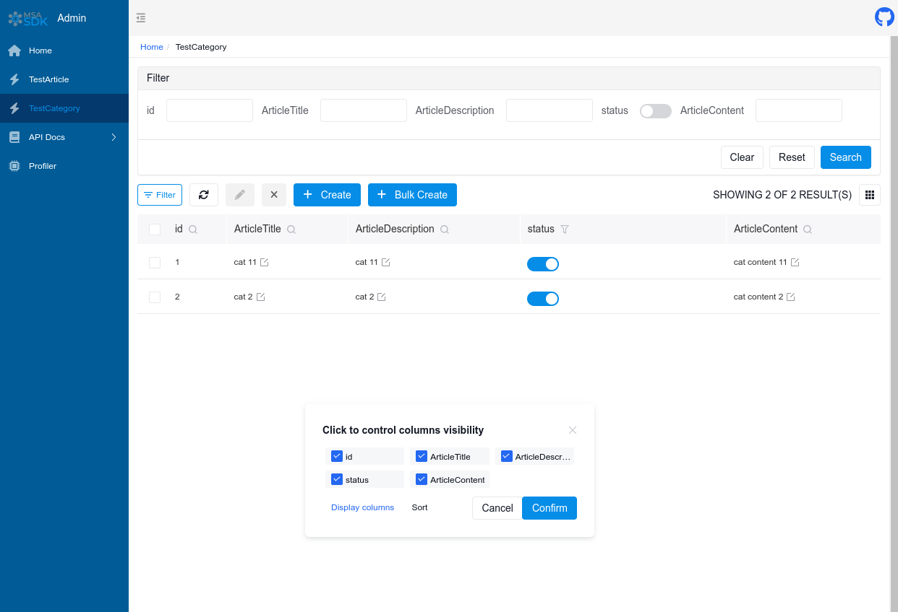
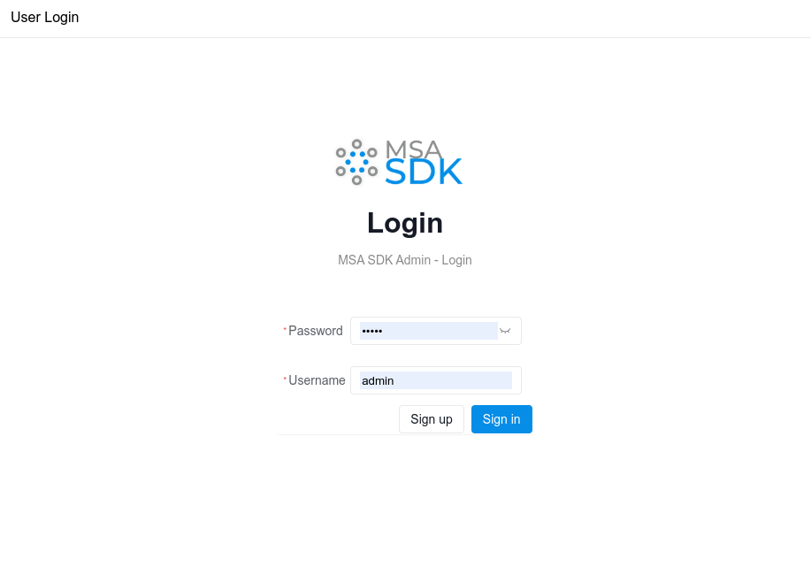
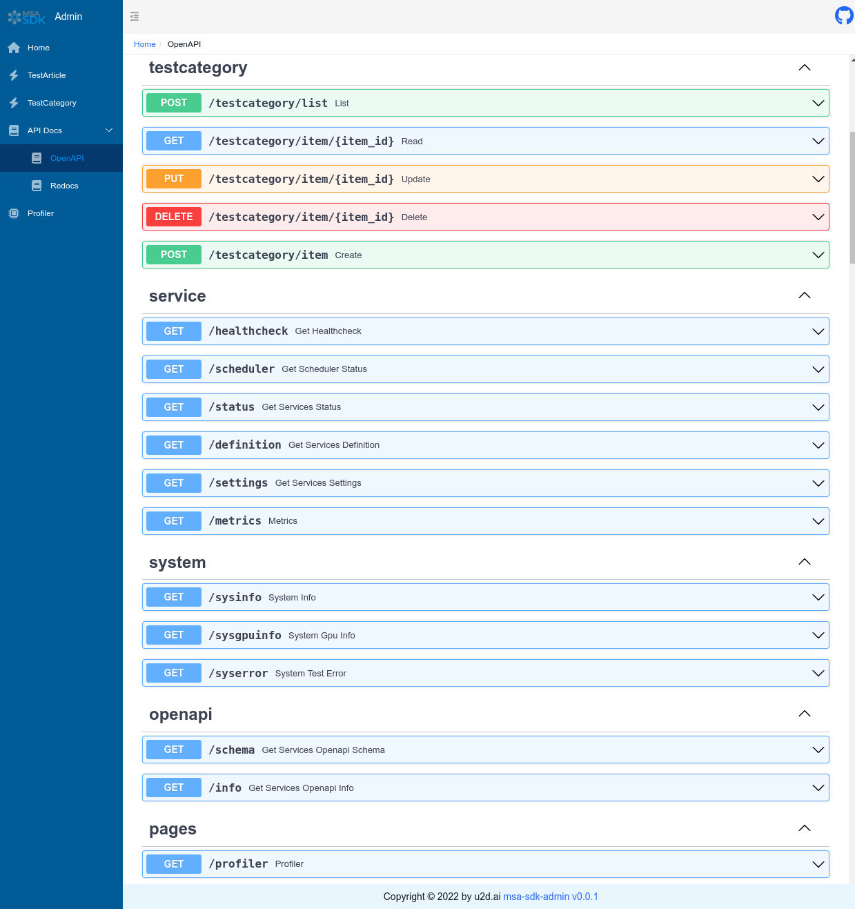

<p align="center">
  
</p>

------
<p align="center">
    <em>msaSDK - FastAPI based Microservice Architecture Development Kit</em>
<br>
    To build PoC's, MVP's, API's with CRUD and Dashboards fast and consistent.
<br>
    Build on top of FastAPI, SQLModel, SQLAlchemy, Amis and many other bullet proofed libraries.
<br>
  <a href="https://pypi.org/project/msaSDK" target="_blank">
      
  </a>
  <a href="https://pypi.org/project/msaSDK" target="_blank">
      
  </a>
</p>

------

## Features
- **Build connected distributed applications faster**: Ready for [Dapr](https://dapr.io/).
- **Consistency**: With sometimes 10s or 100s of Micro Services, the SDK helps to easy version control and provides a stable Dapr Basis.
- **High performance**: Based on [FastAPI](https://fastapi.tiangolo.com/zh/). Enjoy all the benefits.
- **Integrated Scheduler**: Define Scheduler Tasks with natural language timings and dependencies.
- **Integrated Dashboard UI**: Admin and Optional Auth enabled Dashboard with CRUD Forms.
- **Integrated CRUD**: Generates CRUD Router and Admin Dashboard Forms based on SQLModel and SQLAlchemy.
- **Integrated Abstract Filesystem**: Agnostic Abstract Filesystem API which allows to use S3, GCS, Azure Datalake, your local FS, Youtube etc.
- **Integrated justpy WEB UI**: Integrated justpy UI Web Framework to MSAAPI, which allows simple adding of routes to justpy webpages functions.
- **Integrated Dict with Storage Backend**: Use Dict's with backend storage like redis.
- **Integrated Signals**: Use and handle Signals and Tasks.
- **Integrated Feature Management**: Feature switch management with conditions.

## Main Dependencies

- [FastAPI](https://fastapi.tiangolo.com/)
- [SQLModel](https://sqlmodel.tiangolo.com/)
  combined with  [SQLAlchemy](https://www.sqlalchemy.org/) and [Pydantic](https://pydantic-docs.helpmanual.io/), with all
  their features .


### Usage example is in the app module \_\_init\_\_.py
```python
{!./docs_src/home/index_first.py!}
```


# Typical Run Log


## Interface Preview


#### Home Screen with System Info
- Open `http://127.0.0.1:8090/admin/` in your browser:


#### CRUD of SQLModels Screen


#### Login Screen
- Open `http://127.0.0.1:8090/admin/auth/form/login` in your browser:


#### OpenAPI Interactive Documentation (Swagger) Screen
- Open `http://127.0.0.1:8090/#/admin/docs` in your browser:


#### Profiler Screen
- Open `http://127.0.0.1:8090/#/admin/profiler` in your browser:


## License Agreement

- `msaSDK`Based on `MIT` open source and free to use, it is free for commercial use, but please clearly show the copyright information about msaSDK - Auth Admin in the display interface.


## How to create the documentation

We use mkdocs and mkdocsstring. The code reference and nav entry get's created virtually by the triggered python script /docs/gen_ref_pages.py while ``mkdocs`` ``serve`` or ``build`` is executed.

### Requirements Install for the PDF creation option:
PDF Export is using mainly weasyprint, if you get some errors here pls. check there documentation. Installation is part of the msaSDK, so this should be fine.

We can now test and view our documentation using:

    mkdocs serve

Build static Site:

    mkdocs build


## Build and Publish
  
Build:  

    python setup.py sdist

Publish to pypi:

    twine upload dist/*