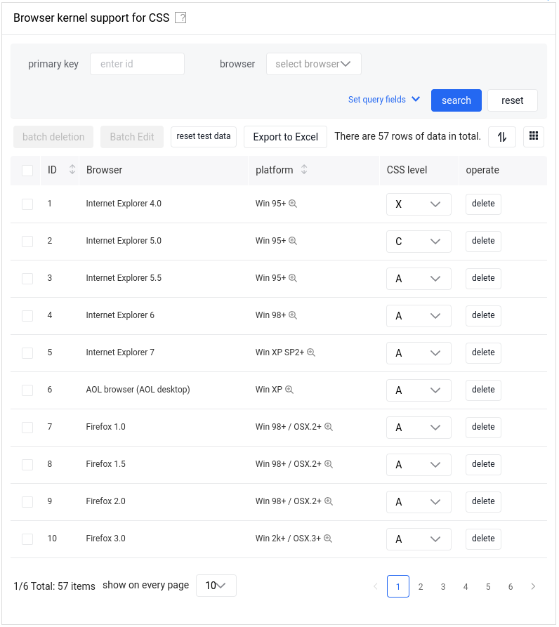

# amis v1.10.1

amis is a low-code front-end framework that uses JSON configuration to generate pages, which can reduce page development efforts and greatly improve efficiency.

It is used to render the json results of pages and form elements from the Admin Site and Auth Admin Site.

[amis documentation site](https://baidu.github.io/amis/zh-CN/docs/index)

## Why amis?

Using FastAPI and Pydantic, JSON is simple to create from nearly any kind of object.

Building a parser that can generate a JSON for a UI seemed pretty straight forward.

Here an example:

=== "UI"
    
=== "JSON"
    ```python
    {
      "title": "Browser kernel support for CSS",
      "remark": "Hey, data accuracy is not guaranteed",
      "type": "page",
      "body": {
        "type": "crud",
        "draggable": true,
        "syncLocation": false,
        "api": "/api/mock2/sample",
        "keepItemSelectionOnPageChange": true,
        "autoGenerateFilter": true,
        "bulkActions": [
          {
            "type": "button",
            "label": "Bulk Delete",
            "actionType": "ajax",
            "api": "delete:/api/mock2/sample/${ids|raw}",
            "confirmText": "Sure you want to bulk delete?"
          },
          {
            "type": "button",
            "label": "Bulk Modify",
            "actionType": "dialog",
            "dialog": {
              "title": "Bulk Edit",
              "name": "sample-bulk-edit",
              "body": {
                "type": "form",
                "api": "/api/mock2/sample/bulkUpdate2",
                "body": [
                  {
                    "type": "hidden",
                    "name": "ids"
                  },
                  {
                    "type": "input-text",
                    "name": "engine",
                    "label": "Engine"
                  }
                ]
              }
            }
          }
        ],
        "quickSaveApi": "/api/mock2/sample/bulkUpdate",
        "quickSaveItemApi": "/api/mock2/sample/$id",
        "headerToolbar": [
          "bulkActions",
          {
            "type": "button",
            "label": "Reset Test Data",
            "actionType": "ajax",
            "size": "sm",
            "api": "/api/mock2/sample/reset"
          },
          "export-excel",
          {
            "type": "tpl",
            "tpl": "There are ${count} rows of data." ,
            "className": "v-middle"
          },
          {
            "type": "columns-toggler",
            "align": "right",
            "draggable": true
          },
          {
            "type": "drag-toggler",
            "align": "right"
          }
        ],
        "footerToolbar": ["statistics", "switch-per-page", "pagination" ],
        "columns": [
          {
            "name": "id",
            "label": "ID",
            "width": 20,
            "sortable": true,
            "type": "text",
            "searchable": {
              "type": "input-text",
              "name": "id",
              "label": "primary-key",
              "placeholder": "input-id"
            }
          },
          {
            "name": "browser",
            "label": "Browser",
            "searchable": {
              "type": "select",
              "name": "browser",
              "label": "browser",
              "placeholder": "select browser",
              "options": [
                {
                  "label": "Internet Explorer",
                  "value": "ie"
                },
                {
                  "label": "AOL browser",
                  "value": "aol"
                },
                {
                  "label": "Firefox",
                  "value": "firefox"
                }
              ]
            }
          },
          {
            "name": "platform",
            "label": "platform",
            "popOver": {
              "trigger": "hover",
              "body": {
                "type": "tpl",
                "tpl": "just to demonstrate a feature called popOver"
              }
            },
            "sortable": true,
            "type": "text"
          },
          {
            "name": "grade",
            "label": "CSS grade",
            "type": "select",
            "options": ["A", "B", "C", "D", "X" ]
          },
          {
            "type": "operation",
            "label": "operation",
            "width": 100,
            "buttons": [
              {
                "type": "button",
                "actionType": "ajax",
                "label": "delete",
                "confirmText": "Are you sure you want to delete?" ,
                "api": "delete:/api/mock2/sample/$id"
              }
            ]
          }
        ]
      }
    }
    ```

Although this interface can be easily made with `Bootstrap` and various other front-end UI libraries, if you spend a closer look, you will reveal that it has a large number of detailed features, such as:

- You can filter the data
- A button to refresh the data
- Edit a single row of data
- Batch modification and deletion
- Sort by a column
- You can hide certain columns
- Columns can be reordered
- Automatic generation of top query fields
- Adjustable column width
- Enables drag-and-drop sorting of full page content
- Tables have paging (pages can also be synced to the address bar, but it's turned off in this example)
- Have data summary
- Support export to Excel
- Rendering engine" column has prompt text in the table header
- There is a magnifying glass symbol when the mouse moves to the "Platform" column, so you can expand it to see more
- If you drag down there is the first line freeze to facilitate the view of the table header (because of the limitations of the document page, this feature is not visible here)

All of this requires a lot of code to implement.

But as you can see, with amis you only need **157** lines of JSON configuration (of which 47 lines have only one bracket), you do not need to understand `React/Vue`, `Webpack`, or even `JavaScript`, even if you have not learned amis you can guess the role of most of the configuration, you just need a simple configuration to complete all page development This is exactly what amis was built for.

This is exactly the reason why amis was built in the first place. 

We thought that **for most common pages**, without learning front-end frameworks and tools, this is a good match, minimum for Admin Dashboards.

## Highlights of amis

- **Provides a complete interface solution** : Other UI frameworks must use JavaScript to assemble business logic, while amis only needs JSON configuration to complete complete functional development, including data acquisition, form submission and verification functions, and the resulting page does not need to go through two The secondary development can be directly launched;
- **A large number of built-in components (120+), one-stop solution** : Most of other UI frameworks only have the most common components. If you encounter some less commonly used components, you have to find a third party yourself, and these third-party components are often displayed and The interaction is inconsistent, and the integration effect is not good, while amis has a large number of built-in components, including business components such as rich text editor, code editor, diff, conditional combination, real-time log, etc. Most of the middle and background page development only needs to understand amis Will suffice;
- **Support expansion** : In addition to the low-code mode, you can also expand components through custom components. In fact, amis can be used as a common UI library to achieve a mixed mode of 90% low code and 10% code development, which not only improves efficiency, but also loss of flexibility;
- **Containers support infinite levels of nesting** : various layout and presentation requirements can be met through nesting;

## When NOT to use amis?
Using JSON has advantages but also significant disadvantages, and is not suitable for he following situations:

- **Mass customization of UI** : JSON configuration makes amis more suitable for pages with a large number of common UI components, but for pages facing ordinary customers (toC), they often pursue personalized visual effects. In this case, using amis is not suitable. In fact Most front-end UI component libraries are also not suitable, and can only be customized development.
- **Extremely complex or special interactions** :
  - Some complex front-end functions, such as the visual editor, have a large number of customized drag-and-drop operations. This kind of function that needs to rely on the native DOM implementation cannot use amis.
  - However, for some areas with fixed interaction, such as graph connection, amis will have special components to implement it later.