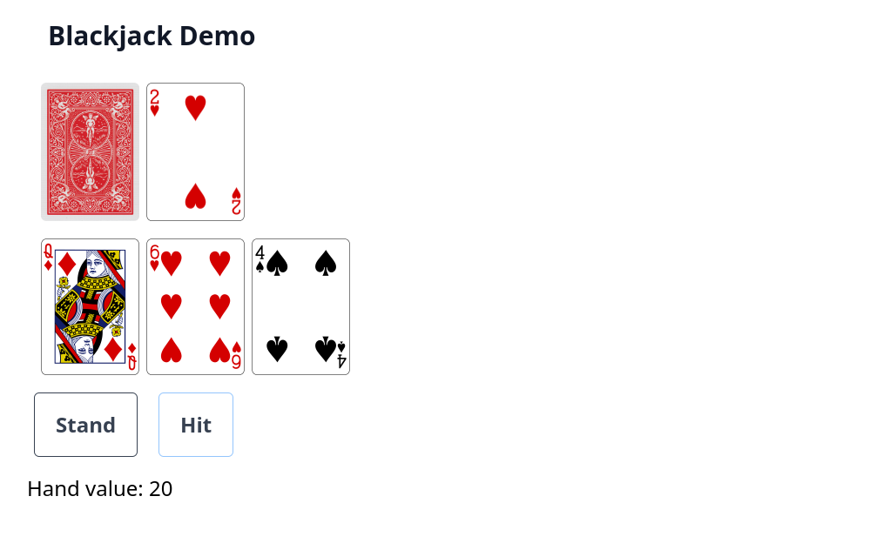
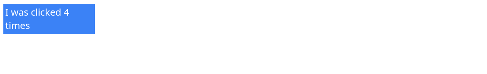
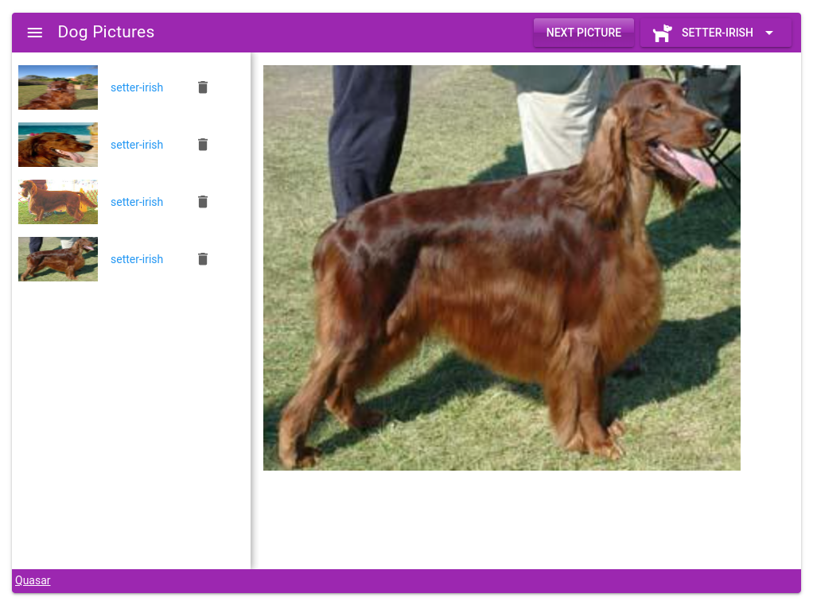
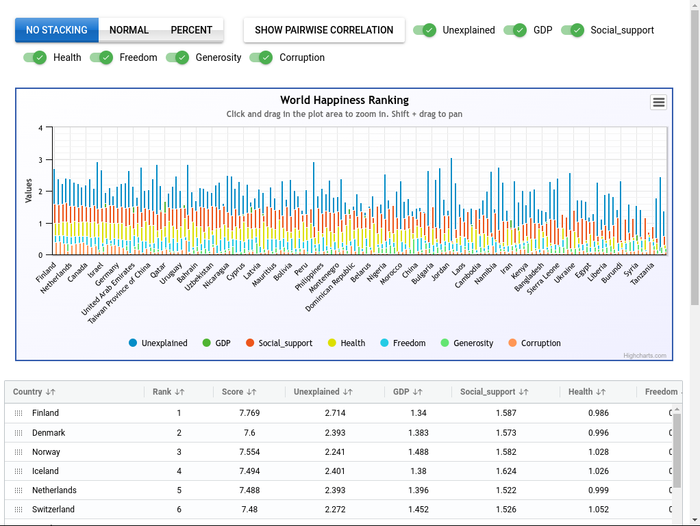
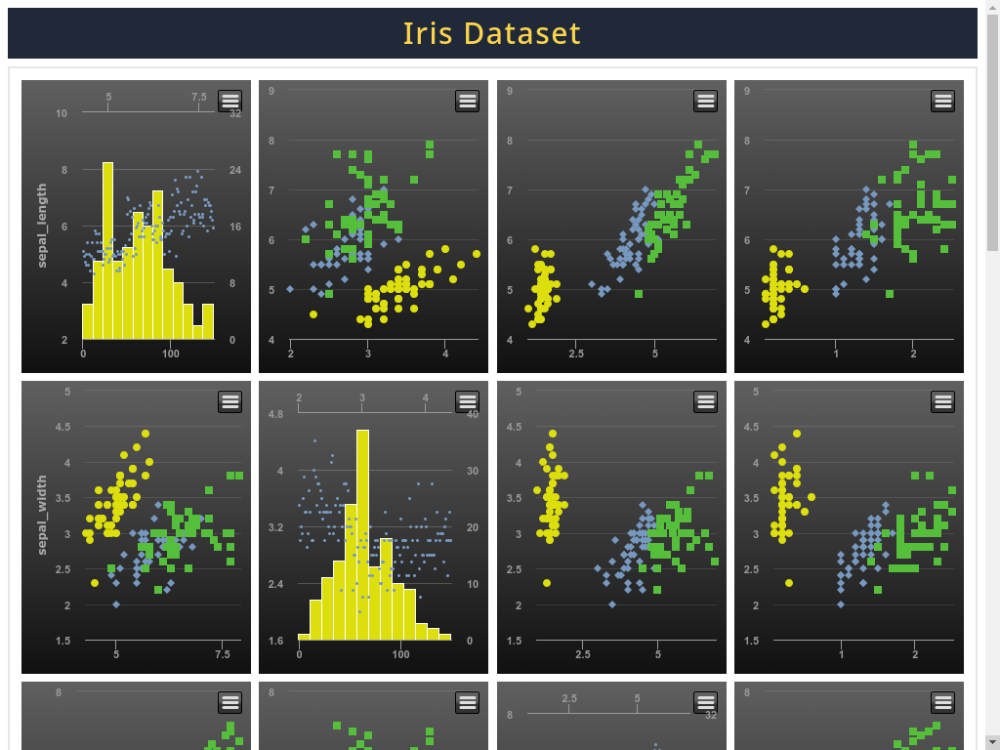
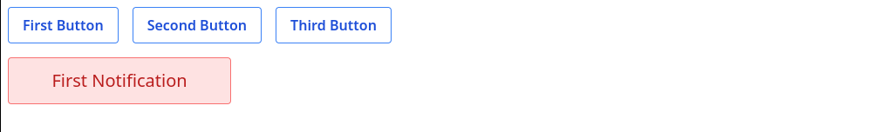
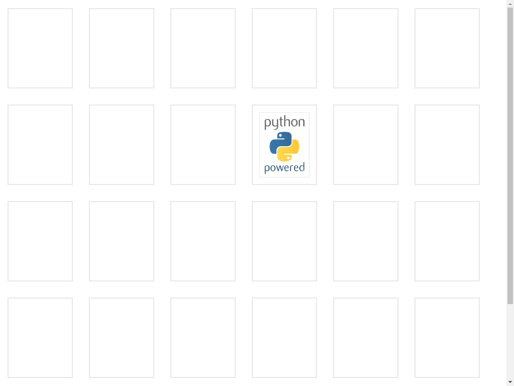
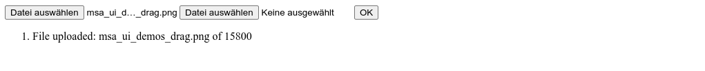

# WEB UI

<h2 align="center">
  msaSDK justpy - WEB UI Integration
</h2>

---
<p align="center">
    <em>Initialized by the MSAApp Class</em>
</p>

---

## Simple Example

Required MSAApp Service Definition (Settings):

    ui_justpy: bool = True
    
    # Optional to get the demos router mounted
    ui_justpy_demos: bool = True

Create the app object first
```python

from msaSDK.models.service import get_msa_app_settings
from msaSDK.service import MSAApp


settings = get_msa_app_settings()
settings.title = "Your Microservice Titel"
settings.version = "0.0.1"
settings.debug = True

# Enable the ui and demo
settings.ui_justpy = True
settings.ui_justpy_demos = True # will mount them all automatically

app = MSAApp(settings=settings)
```

If you want to mount them manually, or your custom UI Code

## Integrated Demo's
### Black Jack - Cards Demo
```python
from msaSDK.utils.ui_demos.card import cards_demo
app.add_jproute("/ui/cards", cards_demo)
```

=== "UI"
    

=== "Code"
    ```python
    import justpy as jp
    import asyncio
    
    card_size = 0.5
    card_width = int(226 * card_size)
    card_height = int(card_width * 314 / 226)
    button_classes = """
    inline-flex items-center px-6 py-6 border border-gray-700 text-2xl leading-6 font-bold rounded-md text-gray-700 
    bg-white hover:text-gray-500 focus:outline-none focus:border-blue-300 focus:shadow-outline-blue active:text-gray-800 
    active:bg-gray-50 transition ease-in-out duration-150
    """
    div_classes = "items-center px-6 py-6 border border-gray-700 text-3xl leading-6 font-bold rounded-md text-gray-700; bg-white "
    
    
    class Card(jp.Img):
        """
        Card component: an extended image with predefined width and height and a transition
        """
    
        def __init__(self, **kwargs):
            """
            constructor
            """
            super().__init__(**kwargs)
            self.width = card_width
            self.height = card_height
            self.set_class("ml-2")
    
            self.transition = {
                "load": "transition origin-left ease-out duration-1000",
                "load_start": "transform scale-x-0",
                "load_end": "transform scale-x-100",
                "enter": "transition origin-left ease-out duration-1000",
                "enter_start": "transform scale-x-0",
                "enter_end": "transform scale-x-100",
            }
    
    
    async def create_deck():
        """
        get a new deck
        """
        deck = await jp.get("https://deckofcardsapi.com/api/deck/new/shuffle/?deck_count=1")
        return deck["deck_id"]
    
    
    async def deal(deck_id, count=1):
        """
        deal
        """
        try:
            cards = await jp.get(
                f"https://deckofcardsapi.com/api/deck/{deck_id}/draw/?count={count}"
            )
        except:
            print("error in deal")
        return cards
    
    
    def hand_value(hand):
        """
        calculate the hand value
        """
        value = 0
        aces = 0
        for card in hand:
            if card.value == "ACE":
                aces += 1
                value += 1
            else:
                try:
                    value += int(card.value)
                except:
                    value += 10
        if aces and value < 12:
            value += 10
        return value
    
    
    async def hit(self, msg):
        """
        react on hit button
        """
        wp = msg.page
        card_dict = jp.Dict(await deal(wp.deck_id))
        card = card_dict.cards[0]
        wp.player_hand.append(card)
        wp.player_div.add(Card(src=card.image))
        player_hand_value = hand_value(wp.player_hand)
        if player_hand_value < 22:
            wp.hand_value_div.text = f"Hand value: {player_hand_value}"
        else:
            wp.hand_value_div.text = f"YOU HAVE BUSTED, Hand value: {player_hand_value}"
            dealer_hand_value = hand_value(wp.dealer_hand)
            result_div = jp.Div(classes=div_classes, a=wp.outer_div)
            result_div.text = f"YOU LOST, Your hand: {player_hand_value}, Dealer's hand: {dealer_hand_value}"
            for btn in [wp.stand_btn, wp.hit_btn]:
                btn.disabled = True
                btn.set_classes("cursor-not-allowed bg-gray-200 opacity-50")
            wp.play_again_btn.remove_class("hidden")
    
    
    async def stand(self, msg):
        """
        react on stand button
        """
        wp = msg.page
        # Show dealer card
        wp.card_back.set_class("hidden")
        wp.down_card.remove_class("hidden")
        for btn in [wp.stand_btn, wp.hit_btn]:
            btn.disabled = True
            btn.set_classes("cursor-not-allowed bg-gray-200 opacity-50")
        await wp.update()
        await asyncio.sleep(1.1)
    
        while True:
            dealer_hand_value = hand_value(wp.dealer_hand)
            if dealer_hand_value > 16:
                break
            card_dict = jp.Dict(await deal(wp.deck_id))
            card = card_dict.cards[0]
            wp.dealer_hand.append(card)
            wp.dealer_div.add(Card(src=card.image))
            await wp.update()
            await asyncio.sleep(1.1)
        player_hand_value = hand_value(wp.player_hand)
        result_div = jp.Div(classes=div_classes, a=wp.outer_div)
        if (dealer_hand_value > 21) or (dealer_hand_value < player_hand_value):
            result_div.text = f"YOU WON, Your hand: {player_hand_value}, Dealer's hand: {dealer_hand_value}"
        elif dealer_hand_value > player_hand_value:
            result_div.text = f"YOU LOST, Your hand: {player_hand_value}, Dealer's hand: {dealer_hand_value}"
        else:
            result_div.text = f"IT IS A DRAW, Your hand: {player_hand_value}, Dealer's hand: {dealer_hand_value}"
    
        wp.play_again_btn.remove_class("hidden")
    
    
    async def play_again(self, msg):
        """
        react on play again button
        """
        wp = msg.page
        await wp.reload()
    
    
    async def blackjack():
        """
        the async web page to serve
        """
        wp = jp.WebPage()
        wp.outer_div = jp.Div(
            classes="container mx-auto px-4 sm:px-6 lg:px-8 space-y-5", a=wp
        )
        wp.deck_id = await create_deck()
        # Deal initial four cards
        cards = jp.Dict(await deal(wp.deck_id, 4))
        wp.player_hand = [cards.cards[0], cards.cards[2]]
        wp.dealer_hand = [cards.cards[1], cards.cards[3]]
        jp.Div(
            text="Blackjack Demo",
            a=wp.outer_div,
            classes="m-2 p-4 text-3xl font-bold leading-7 text-gray-900  sm:leading-9 sm:truncate",
        )
        wp.dealer_div = jp.Div(classes="flex flex-wrap m-2", a=wp.outer_div)
        # Image of back of card
        wp.card_back = Card(
            src="https://raw.githubusercontent.com/elimintz/elimintz.github.io/master/card_back.png",
            a=wp.dealer_div,
        )
        wp.down_card = Card(src=wp.dealer_hand[0].image, a=wp.dealer_div, classes="hidden")
        Card(src=wp.dealer_hand[1].image, a=wp.dealer_div, style="transition-delay: 1000ms")
        wp.player_div = jp.Div(classes="flex flex-wrap m-2", a=wp.outer_div)
        for card in wp.player_hand:
            Card(src=card.image, a=wp.player_div, style="transition-delay: 2000ms")
        button_div = jp.Div(classes="flex m-2 space-x-6", a=wp.outer_div)
        wp.stand_btn = jp.Button(
            text="Stand", a=button_div, classes=button_classes, click=stand
        )
        wp.hit_btn = jp.Button(text="Hit", a=button_div, classes=button_classes, click=hit)
        wp.play_again_btn = jp.Button(
            text="Play Again", a=button_div, classes=button_classes, click=play_again
        )
        wp.play_again_btn.set_class("hidden")
        wp.hand_value_div = jp.Div(
            text=f"Hand value: {hand_value(wp.player_hand)}",
            a=wp.outer_div,
            classes="text-2xl",
        )
        return wp
    
    
    async def cards_demo():
        return await blackjack()

    ```

### Click Event Demo
```python
from msaSDK.utils.ui_demos.click import click_demo
app.add_jproute("/ui/click", click_demo)
```
=== "UI"
    

=== "Code"
    ```python
    class ClickDemo:
        """
        demo for click handling
        """
    
        async def onDivClick(self, msg):
            """
            handle a click on the Div
            """
            print(msg)
            self.clickCount += 1
            msg.target.text = f"I was clicked {self.clickCount} times"
    
        async def click_demo(self):
            """
            the example Webpage under test
            """
            import justpy as jp
            wp = jp.WebPage(debug=False)
            self.clickCount = 0
            d = jp.Div(
                text="Not clicked yet",
                a=wp,
                classes="w-48 text-xl m-2 p-1 bg-blue-500 text-white",
            )
            d.on("click", self.onDivClick)
            d.additional_properties = [
                "screenX",
                "pageY",
                "altKey",
                "which",
                "movementX",
                "button",
                "buttons",
            ]
    
            return wp
    
    
    async def click_demo():
        clickDemo = ClickDemo()
        return await clickDemo.click_demo()

    ```

### Dogs App Demo
```python
from msaSDK.utils.ui_demos.dogs import dogs_demo
app.add_jproute("/ui/dogs", dogs_demo)
```
=== "UI"
    

=== "Code"
    ```python
    # see https://github.com/justpy-org/justpy/blob/master/examples/dogs.py
    from justpy import *
    from starlette.requests import Request
    
    # https://dog.ceo/api/breeds/list/all    dict of all breeds under
    
    breeds = [
        "affenpinscher",
        "african",
        "airedale",
        "akita",
        "appenzeller",
        "basenji",
        "beagle",
        "bluetick",
        "borzoi",
        "bouvier",
        "boxer",
        "brabancon",
        "briard",
        "bullterrier-staffordshire",
        "cairn",
        "cattledog-australian",
        "chihuahua",
        "chow",
        "clumber",
        "cockapoo",
        "collie-border",
        "coonhound",
        "corgi-cardigan",
        "cotondetulear",
        "dachshund",
        "dalmatian",
        "deerhound-scottish",
        "dhole",
        "dingo",
        "doberman",
        "elkhound-norwegian",
        "entlebucher",
        "eskimo",
        "frise-bichon",
        "germanshepherd",
        "greyhound-italian",
        "groenendael",
        "hound-blood",
        "hound-english",
        "hound-ibizan",
        "hound-walker",
        "husky",
        "keeshond",
        "kelpie",
        "komondor",
        "kuvasz",
        "labrador",
        "leonberg",
        "lhasa",
        "malamute",
        "malinois",
        "maltese",
        "mastiff-bull",
        "mastiff-tibetan",
        "mexicanhairless",
        "mix",
        "mountain-bernese",
        "mountain-swiss",
        "newfoundland",
        "otterhound",
        "papillon",
        "pekinese",
        "pembroke",
        "pinscher-miniature",
        "pointer-german",
        "pomeranian",
        "pug",
        "puggle",
        "pyrenees",
        "redbone",
        "retriever-chesapeake",
        "retriever-curly",
        "retriever-flatcoated",
        "retriever-golden",
        "ridgeback-rhodesian",
        "rottweiler",
        "saluki",
        "samoyed",
        "schipperke",
        "schnauzer-giant",
        "schnauzer-miniature",
        "setter-english",
        "setter-gordon",
        "setter-irish",
        "sheepdog-english",
        "sheepdog-shetland",
        "shiba",
        "shihtzu",
        "spaniel-blenheim",
        "spaniel-brittany",
        "spaniel-cocker",
        "spaniel-irish",
        "spaniel-japanese",
        "spaniel-sussex",
        "spaniel-welsh",
        "springer-english",
        "stbernard",
        "terrier-american",
        "terrier-australian",
        "terrier-bedlington",
        "terrier-border",
        "terrier-dandie",
        "terrier-fox",
        "terrier-irish",
        "terrier-kerryblue",
        "terrier-lakeland",
        "terrier-norfolk",
        "terrier-norwich",
        "terrier-patterdale",
        "terrier-russell",
        "terrier-scottish",
        "terrier-sealyham",
        "terrier-silky",
        "terrier-tibetan",
        "terrier-toy",
        "terrier-westhighland",
        "terrier-wheaten",
        "terrier-yorkshire",
        "vizsla",
        "weimaraner",
        "whippet",
        "wolfhound-irish",
    ]
    
    
    async def dog_test(_request):
        """
        create a reactive webpage for dog pictures taken from
        """
        wp = QuasarPage()
        wp.body_style = "overflow: hidden"
        bp = parse_html(
            """
        <div class="q-pa-md">
        <q-layout view="HHH lpr Fff" container  style="height: 95vh" class="shadow-2 rounded-borders">
            <q-header reveal class="bg-purple">
                <q-toolbar name="toolbar">
                    <q-btn flat round dense icon="menu"/>
                    <q-toolbar-title>Dog Pictures</q-toolbar-title>
                    <q-btn glossy label="Next Picture" classes="q-mr-sm" name="next_picture"></q-btn>
                </q-toolbar>
            </q-header>
            <q-drawer name="drawer" width=300 breakpoint=700 show-if-above elevated content-class="bg-white text-blue">
                <q-scroll-area class="fit">
                    <div class="q-pa-sm">
                        <q-list name="thumbnail_list">
                        </q-list>
                    </div>
                </q-scroll-area>
            </q-drawer>
            <q-footer class="bg-purple text-white">
                <div class="text-white q-pa-xs" style="height: 30px;" name="footer"></div>
            </q-footer>
            <q-page-container style="overflow: hidden;">
                <q-page padding name="main_page" style="overflow: hidden;">
                        <div style="height: 400px; width: 600px">
                            <q-img src="https://images.dog.ceo/breeds/papillon/n02086910_6087.jpg" class="cursor-pointer" name="image" >
                           </div>
                           <q-tooltip content-class="bg-purple" content-style="font-size: 13px" transition-show="scale" transition-hide="scale" anchor="top middle"  name="tooltip">
              Click image for next picture
            </q-tooltip>
                        </q-img>
                </q-page>
            </q-page-container>
        </q-layout>
    </div>
        """,
            a=wp,
        )
        main_image = bp.name_dict["image"]
        l = Link(
            href="https://quasar.dev", text="Quasar", target="_blank", classes="text-white"
        )
        bp.name_dict["footer"].add(l)
        bp.name_dict["tooltip"].disable_events = True
        main_image.breed = "papillon"
        breed_select = QBtnDropdown(
            auto_close=True,
            split=False,
            glossy=True,
            label="Select Breed",
            icon="fas fa-dog",
            a=bp.name_dict["toolbar"],
        )
        breed_list = QList(separator=True, dense=True, a=breed_select)
    
        async def change_breed(self, msg):
            main_image.breed = self.breed
            await change_pic(main_image, msg)
            breed_select.label = self.breed
    
        for breed in breeds:
            breed_item_html = f"""<q-item clickable v-close-menu v-ripple>
                                <q-item-section >
                                    <q-item-label>{breed}</q-item-label>
                                </q-item-section>
                            </q-item>"""
            # breed_item = parse_html(breed_item_html).first()
            breed_item = parse_html(breed_item_html)
            breed_item.breed = breed
            breed_item.on("click", change_breed)
            breed_list.add(breed_item)
    
        def add_thumbnail(self, _msg):
            """
            add a thumbnail
            """
            list_item_html = f"""<q-item clickable v-ripple>
                                <q-item-section thumbnail>
                                    
                                </q-item-section>
                                <q-item-section>{self.breed}</q-item-section>
                                <q-item-section> <q-btn class="gt-xs text-grey-8" size="12px" flat dense round icon="delete" name="delete"/></q-item-section>
                            </q-item>"""
            list_item = parse_html(list_item_html)
            list_item.breed = self.breed
            list_item.src = self.src
    
            list_item.name_dict["delete"].list = bp.name_dict["thumbnail_list"]
            list_item.name_dict["delete"].list_item = list_item
            bp.name_dict["thumbnail_list"].add(list_item)
    
            def display_thumbnail(self, _msg):
                """
                display a thumbnail
                """
                main_image.src = self.src
    
            list_item.on("mouseenter", display_thumbnail)
    
            def delete_list_item(self, _msg):
                """
                delete a list item
                """
                self.list.remove(self.list_item)
    
            list_item.name_dict["delete"].on("click", delete_list_item)
    
        async def change_pic(self, msg):
            """
            change the pictures
            """
            # https://dog.ceo/api/breed/bulldog/french/images/random
            if "-" in self.breed:
                b = self.breed.split("-")
                r = await get(f"https://dog.ceo/api/breed/{b[0]}/{b[1]}/images/random")
            else:
                r = await get(f"https://dog.ceo/api/breed/{self.breed}/images/random")
            self.src = r["message"]
            add_thumbnail(self, msg)
    
        async def next_pic(self, msg):
            """
            react on next picture clicked
            """
            return await change_pic(main_image, msg)
    
        # allow clicking an image
        main_image.on("click", change_pic)
        bp.name_dict["next_picture"].on("click", next_pic)
    
        # initial picture
        await change_pic(main_image, {})
        return wp
    
    
    async def dogs_demo(request: Request):
        return await dog_test(request)

    ```

### Happiness Dataset Demo - World Happiness Ranking
```python
from msaSDK.utils.ui_demos.happiness import happiness_demo, corr_stag_test, corr_test
app.add_jproute("/ui/happiness", happiness_demo)
# the sub routes in the happiness demo
app.add_jproute("/corr_staggered", corr_stag_test)
app.add_jproute("/corr", corr_test)
```
=== "UI"
    

=== "Code"
    ```python
    import justpy as jp
    import pandas as pd
    import numpy as np
    import asyncio
    
    from starlette.requests import Request
    
    # https://worldhappiness.report/ed/2019/
    df = pd.read_csv("http://elimintz.github.io/happiness_report_2019.csv").round(3)
    
    
    def grid_change(self, msg):
        msg.page.df = jp.read_csv_from_string(msg.data)
        c = msg.page.df.jp.plot(
            "Country",
            msg.page.cols_to_plot,
            kind="column",
            title="World Happiness Ranking",
            subtitle="Click and drag in the plot area to zoom in. Shift + drag to pan",
            stacking=msg.page.stacking,
            temp=True,
        )
        msg.page.c.options = c.options
    
    
    def stack_change(self, msg):
        msg.page.c.options.plotOptions.series.stacking = self.value
        msg.page.stacking = self.value
    
    
    def series_change(self, msg):
        msg.page.cols_to_plot = []
        for i, toggle in enumerate(msg.page.toggle_list):
            if toggle.value:
                msg.page.cols_to_plot.append(i + 3)
        c = msg.page.df.jp.plot(
            "Country",
            msg.page.cols_to_plot,
            kind="column",
            title="World Happiness Ranking",
            subtitle="Click and drag in the plot area to zoom in. Shift + drag to pan",
            stacking=msg.page.stacking,
            temp=True,
        )
        msg.page.c.options = c.options
    
    
    async def corr_button_click(self, msg):
        msg.page.open = "/corr"
        await msg.page.update()
        msg.page.open = ""
        return True
    
    
    def happiness_plot(request):
        # ['Country', 'Rank', 'Score', 'Unexplained', 'GDP', 'Social_support', 'Health', 'Freedom', 'Generosity', Corruption']
        wp = jp.QuasarPage()
        chart_theme = request.query_params.get("theme", 8)  # Default is 'grid'
        themes = [
            "high-contrast-dark",
            "high-contrast-light",
            "avocado",
            "dark-blue",
            "dark-green",
            "dark-unica",
            "gray",
            "grid-light",
            "grid",
            "sand-signika",
            "skies",
            "sunset",
        ]
        wp.highcharts_theme = themes[int(chart_theme)]
        wp.stacking = ""
        wp.cols_to_plot = [3, 4, 5, 6, 7, 8, 9]
        wp.df = df
        d = jp.Div(classes="q-ma-lg", a=wp)
        bg = jp.QBtnToggle(
            push=True,
            glossy=True,
            toggle_color="primary",
            value="",
            a=d,
            input=stack_change,
            style="margin-right: 30px",
        )
        bg.options = [
            {"label": "No Stacking", "value": ""},
            {"label": "Normal", "value": "normal"},
            {"label": "percent", "value": "percent"},
        ]
        wp.toggle_list = []
        corr_button = jp.QBtn(
            label="Show pairwise correlation", a=d, click=corr_button_click
        )
        for i in df.columns[3:]:
            wp.toggle_list.append(
                jp.QToggle(
                    checked_icon="check",
                    color="green",
                    unchecked_icon="clear",
                    value=True,
                    label=f"{i}",
                    a=d,
                    input=series_change,
                )
            )  # ,style='margin-right: 10px',
        chart = df.jp.plot(
            "Country",
            wp.cols_to_plot,
            kind="column",
            a=wp,
            title="World Happiness Ranking",
            subtitle="Click and drag in the plot area to zoom in. Shift + drag to pan",
            stacking="",
            classes="border m-2 p-2 q-ma-lg p-ma-lg",
        )
        grid = df.jp.ag_grid(a=wp)
        grid.options.columnDefs[0].rowDrag = True
        for event_name in ["sortChanged", "filterChanged", "columnMoved", "rowDragEnd"]:
            grid.on(event_name, grid_change)
        wp.c = chart
        grid.c = chart
        bg.c = chart
        return wp
    
    
    class ScatterWithRegression(jp.Scatter):
        def __init__(self, x, y, **kwargs):
            super().__init__(x, y, **kwargs)
            x = np.asarray(x)
            y = np.asarray(y)
            m = (len(x) * np.sum(x * y) - np.sum(x) * np.sum(y)) / (
                len(x) * np.sum(x * x) - np.sum(x) ** 2
            )
            b = (np.sum(y) - m * np.sum(x)) / len(x)
            s = jp.Dict()  # The new series
            s.type = "line"
            s.marker.enabled = False
            s.enableMouseTracking = False
            min = float(x.min())
            max = float(x.max())
            s.data = [[min, m * min + b], [max, m * max + b]]
            s.name = f"Regression, m: {round(m, 3)}, b: {round(b, 3)}"
            self.options.series.append(s)
    
    
    chart_list = []
    
    
    def create_corr_page():
        # creates a page showing correlation between factors
        score_factors = [
            "Unexplained",
            "GDP",
            "Social_support",
            "Health",
            "Freedom",
            "Generosity",
            "Corruption",
        ]
        wp = jp.WebPage(delete_flag=False)
        d = jp.Div(a=wp, classes="flex flex-wrap")
        for x_col in score_factors:
            for y_col in score_factors[score_factors.index(x_col) + 1 :]:
                x = df[x_col]
                y = df[y_col]
                chart = ScatterWithRegression(
                    x,
                    y,
                    a=d,
                    style="width: 400px; height: 400px; margin: 10px;",
                    classes="border",
                )
                chart_list.append(chart)
                o = chart.options
                o.title.text = f"{x_col} vs. {y_col}"
                o.xAxis.title.text = x_col
                o.yAxis.title.text = y_col
                o.tooltip.pointFormat = f"{{point.country}}<br/></b>{x_col}: <b>{{point.x}}</b><br/></b>{y_col}: <b>{{point.y}}</b><br/>"
                o.tooltip.useHtml = True
                o.series[0].name = f"{x_col} vs. {y_col}"
                data = []
                # Make the first series data a dictionary so that the country name  will be available to the tooltip
                for i, point in enumerate(o.series[0].data):
                    data.append({"x": point[0], "y": point[1], "country": df["Country"][i]})
                o.series[0].data = data
        corr_def = (
            df[
                [
                    "Unexplained",
                    "GDP",
                    "Social_support",
                    "Health",
                    "Freedom",
                    "Generosity",
                    "Corruption",
                ]
            ]
            .corr()
            .round(3)
        )
        corr_def.insert(loc=0, column="Factors/Factors", value=corr_def.index)
        g = corr_def.jp.ag_grid(a=wp, style="width: 90%; height: 250px", classes="m-2")
        return wp
    
    
    corr_page = create_corr_page()
    
    
    
    async def corr_test():
        return corr_page
    
    
    async def page_ready(self, msg):
        wp = msg.page
        for chart in chart_list:
            wp.d.add(chart)
            await self.update()
            await asyncio.sleep(0.5)
    
    
    # Loads charts one by one to page, improving user experience
    
    async def corr_stag_test():
        wp = jp.WebPage()
        wp.on("page_ready", page_ready)
        wp.d = jp.Div(a=wp, classes="flex flex-wrap")
        return wp
    
    
    async def happiness_demo(request: Request):
        return happiness_plot(request)

    ```

### Iris Dataset Demo
```python
from msaSDK.utils.ui_demos.iris import iris_demo
app.add_jproute("/ui/iris", iris_demo)
```
=== "UI"
    

=== "Code"
    ```python
    import justpy as jp
    import pandas as pd
    
    iris = pd.read_csv(
        "https://raw.githubusercontent.com/mwaskom/seaborn-data/master/iris.csv"
    )
    iris_stats = iris.describe().round(3)
    iris_stats.insert(loc=0, column="stats", value=iris_stats.index)
    iris_species = list(iris["species"].unique())
    
    # Create a dictionary of frames per iris species
    iris_species_frames = {}
    for s in iris_species:
        iris_species_frames[s] = iris.loc[iris["species"] == s]
    
    
    async def click_point(self, msg):
        # print(msg)
        return await self.select_point(
            [
                {"id": chart_id, "series": msg.series_index, "point": msg.point_index}
                for chart_id in self.chart_list
                if self.id != chart_id
            ],
            msg.websocket,
        )
    
    
    async def tooltip_formatter(self, msg):
        # print(msg)
        tooltip_html = f"""
        <div style="color: {msg.color}"><span>&#x25CF;</span> {msg.series_name}</div>
        <div style="color: {msg.color}">{self.col1}: {msg.x}</div>
        <div style="color: {msg.color}">{self.col2}: {msg.y}</div>
        """
        await self.draw_crosshair(
            [
                {"id": chart_id, "series": msg.series_index, "point": msg.point_index}
                for chart_id in self.chart_list
            ],
            msg.websocket,
        )
        return await self.tooltip_update(tooltip_html, msg.websocket)
    
    
    def iris_data():
        wp = jp.WebPage(highcharts_theme="gray", title="Iris Dataset", debug=True)
        jp.Div(
            text="Iris Dataset",
            classes="text-3xl m-2 p-2 font-medium tracking-wider text-yellow-300 bg-gray-800 text-center",
            a=wp,
        )
        d1 = jp.Div(classes="m-2 p-2 border-2", a=wp)
        chart_list = []
        for i, col1 in enumerate(iris.columns[:4]):
            d2 = jp.Div(classes="flex", a=d1)
            for j, col2 in enumerate(iris.columns[:4]):
                if i != j:  # Not on the diagonal
                    chart = jp.HighCharts(
                        a=d2, style="width: 300px; height: 300px", classes="flex-grow m-1"
                    )
                    chart_list.append(chart.id)
                    chart.chart_list = chart_list
                    chart.on("tooltip", tooltip_formatter)
                    chart.tooltip_y = 85
                    chart.on("point_click", click_point)
                    chart.col1 = col1
                    chart.col2 = col2
                    o = chart.options
                    o.chart.type = "scatter"
                    o.chart.zoomType = "xy"
                    o.title.text = ""
                    o.legend.enabled = False
                    o.credits.enabled = (
                        False if i < 3 or j < 3 else True
                    )  # https://api.highcharts.com/highcharts/credits.enabled
                    o.xAxis.title.text = col2 if i == 3 else ""
                    o.yAxis.title.text = col1 if j == 0 else ""
                    o.xAxis.crosshair = o.yAxis.crosshair = True
                    for k, v in iris_species_frames.items():
                        s = jp.Dict()
                        s.name = k
                        s.allowPointSelect = True  # https://api.highcharts.com/highcharts/series.scatter.allowPointSelect
                        s.marker.states.select.radius = 8
                        s.data = list(zip(v.iloc[:, j], v.iloc[:, i]))
                        o.series.append(s)
                else:
                    chart = jp.Histogram(
                        list(iris.iloc[:, j]),
                        a=d2,
                        style="width: 300px; height: 300px",
                        classes="flex-grow m-1",
                    )
                    o = chart.options
                    o.title.text = ""
                    o.legend.enabled = False
                    o.xAxis[0].title.text = col2 if i == 3 else ""
                    o.xAxis[1].title.text = ""
                    o.yAxis[0].title.text = col1 if j == 0 else ""
                    o.yAxis[1].title.text = ""
                    o.credits.enabled = False if i < 3 or j < 3 else True
    
        # Add two grids, first with the data and second with statistics describing the data
        iris.jp.ag_grid(
            a=wp,
            classes="m-2 p-2",
            style="height: 500px; width: 800px",
            auto_size=True,
            theme="ag-theme-balham-dark",
        )
        iris_stats.jp.ag_grid(
            a=wp,
            classes="m-2 p-2 border",
            style="height: 500px; width: 950px",
            auto_size=True,
            theme="ag-theme-material",
        )
        return wp
    
    
    async def iris_demo():
        return iris_data()

    ```

### Quasar Demo
```python
from msaSDK.utils.ui_demos.quasar import quasar_demo
app.add_jproute("/ui/quasar", quasar_demo)
```
=== "UI"
    

=== "Code"
    ```python
    import random
    
    
    async def my_click(self, msg):
        self.color = random.choice(
            [
                "primary",
                "secondary",
                "accent",
                "dark",
                "positive",
                "negative",
                "info",
                "warning",
            ]
        )
        self.label = self.color
        msg.page.dark = not msg.page.dark
        await msg.page.set_dark_mode(msg.page.dark)
    
    
    def quasar_example():
        wp = jp.QuasarPage(dark=True)  # Load page in dark mode
        d = jp.Div(classes="q-pa-md q-gutter-sm", a=wp)
        jp.QBtn(color="primary", icon="mail", label="On Left", a=d, click=my_click)
        jp.QBtn(color="secondary", icon_right="mail", label="On Right", a=d, click=my_click)
        jp.QBtn(
            color="red",
            icon="mail",
            icon_right="send",
            label="On Left and Right",
            a=d,
            click=my_click,
        )
        jp.Br(a=d)
        jp.QBtn(
            icon="phone",
            label="Stacked",
            stack=True,
            glossy=True,
            color="purple",
            a=d,
            click=my_click,
        )
        return wp
    
    
    async def quasar_demo():
        return quasar_example()

    ```

### Notification Demo
```python
from msaSDK.utils.ui_demos.after import after_click_demo
app.add_jproute("/ui/after", after_click_demo)
```
=== "UI"
    

=== "Code"
    ```python
    import justpy as jp
    
    btn_classes = jp.Styles.button_outline + " m-2"
    notification_classes = "m-2 text-center text-xl bg-red-100 border border-red-400 text-red-700 px-4 py-3 rounded w-64"
    
    
    def btn_click(self, msg):
        self.nl[self.list_index].show = True
    
    
    def btn_after(self, msg):
        self.nl[self.list_index].show = False
    
    
    def after_demo():
        wp = jp.WebPage()
        btn_list = []
        notification_list = []
    
        for index, btn_text in enumerate(["First", "Second", "Third"]):
            btn_list.append(
                jp.Button(
                    text=f"{btn_text} Button",
                    classes=btn_classes,
                    a=wp,
                    nl=notification_list,
                    list_index=index,
                    click=btn_click,
                    after=btn_after,
                )
            )
    
        for notification_text in ["First", "Second", "Third"]:
            notification_list.append(
                jp.Div(
                    text=f"{notification_text} Notification",
                    classes=notification_classes,
                    a=wp,
                    show=False,
                )
            )
    
        return wp
    
    
    # initialize the demo
    async def after_click_demo():
    ```

### Drag & Drop Demo
```python
from msaSDK.utils.ui_demos.drag import drag_demo
app.add_jproute("/ui/drag", drag_demo)
```
=== "UI"
    

=== "Code"
    ```python
    import justpy as jp
    
    
    def drag_start(self, msg):
        print("in drag start")
        print(msg)
        msg.page.image.animation = False
        return True
    
    
    def drop(self, msg):
        print("in drop")
        print(msg)
        wp = msg.page
        wp.image.animation = "zoomIn"
        if self.index != wp.current_index:
            wp.div_list[self.index].add(wp.image)
            wp.div_list[wp.current_index].components = []
            wp.current_index = self.index
    
    
    def drag_test():
        wp = jp.WebPage()
        wp.current_index = 0
        drag_options = {"drag_classes": "text-white bg-red-500"}
        wp.image = jp.Img(
            src="https://www.python.org/static/community_logos/python-powered-h-140x182.png",
            height=100,
            width=100,
            classes="border faster",
            drag_options=drag_options,
            animation="zoomIn",
        )
        wp.image.on("dragstart", drag_start)
    
        d = jp.Div(classes="flex flex-wrap", a=wp)
        wp.div_list = [
            jp.Div(
                style="height: 160px; width: 130px",
                classes="m-4 border-2 flex items-center justify-center",
                drop=drop,
                a=d,
                index=i,
            )
            for i in range(30)
        ]
        for div in wp.div_list:
            div.events.append("dragover")
        wp.div_list[0].add(wp.image)
        return wp
    
    
    async def drag_demo():
        return drag_test()
    ```

### Multiple Uploads Demo
```python
from msaSDK.utils.ui_demos.uploads import upload_demo
app.add_jproute("/ui/upload", upload_demo)
```
=== "UI"
    

=== "Code"
    ```python
    from justpy import Form, Input, Li, Ol, WebPage
    
    # see https://github.com/elimintz/justpy/pull/401
    
    
    def handle_submit(_c, msg):
        """
        handle submission of a multi upload
        """
        fl = msg.page.file_list
        fl.components.clear()
        for fd in msg.form_data:
            if "files" in fd:
                for f in fd["files"]:
                    Li(text=f"File uploaded: {f['name']} of {len(f['file_content'])}", a=fl)
    
    
    def multiupload():
        """
        show a multi upload
        """
        wp = WebPage()
        WebPage.tailwind = False
        f = Form(submit=handle_submit, a=wp)
        Input(name="f1", type="file", a=f)
        Input(name="f2", type="file", a=f)
        Input(type="submit", value="OK", a=f)
        wp.file_list = Ol(a=wp)
        return wp
    
    
    async def upload_demo():
        return multiupload()
    ```
