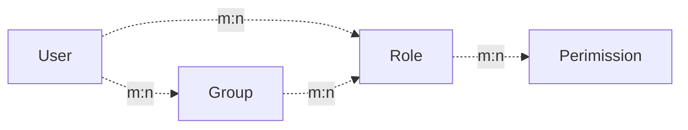
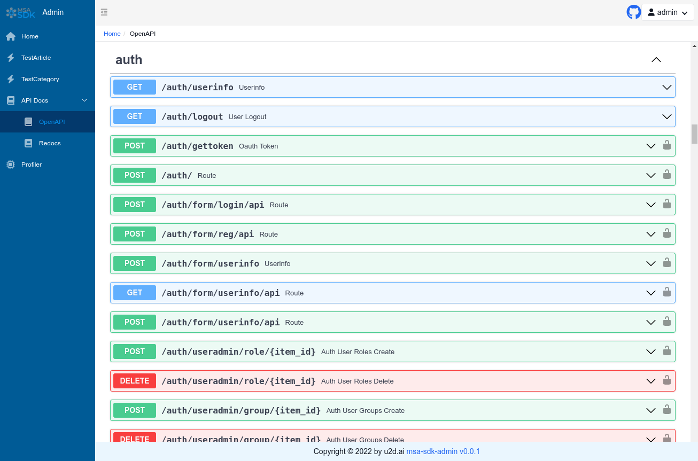

# Auth Admin Site

<h2 align="center">
  MSA SDK Auth
</h2>
<p align="center">
    <em>MSA SDK Auth.</em><br/>
    <em>Auth Site that includes in Admin Site Web UI.</em>
</p>


------

## Simple Example

```python
from fastapi import FastAPI
from fastapi_amis_admin.admin.settings import Settings
from fastapi_user_auth.site import AuthAdminSite
from starlette.requests import Request
from sqlmodel import SQLModel

app = FastAPI()

site = AuthAdminSite(settings = Settings(database_url_async = 'sqlite+aiosqlite:///amisadmin.db'))
auth = site.auth

site.mount_app(app)


@app.on_event("startup")
async def startup():
    await site.db.async_run_sync(SQLModel.metadata.create_all, is_session = False)

    await auth.create_role_user('admin')
    await auth.create_role_user('vip')


@app.get("/auth/get_user")
@auth.requires()
def get_user(request: Request):
    return request.user

if __name__ == '__main__':
    import uvicorn

    uvicorn.run(app, debug = True)

```

## Validation Method

### Decorator

- Recommended scenario: Single route. Supports synchronous/asynchronous routing.

```python
@app.get("/auth/user")
@auth.requires()
def user(request: Request):
    return request.user  


@app.get("/auth/admin_roles")
@auth.requires('admin')
def admin_roles(request: Request):
    return request.user


@app.get("/auth/vip_roles")
@auth.requires(['vip'])
async def vip_roles(request: Request):
    return request.user


@app.get("/auth/admin_or_vip_roles")
@auth.requires(roles = ['admin', 'vip'])
def admin_or_vip_roles(request: Request):
    return request.user


@app.get("/auth/admin_groups")
@auth.requires(groups = ['admin'])
def admin_groups(request: Request):
    return request.user


@app.get("/auth/admin_roles_and_admin_groups")
@auth.requires(roles = ['admin'], groups = ['admin'])
def admin_roles_and_admin_groups(request: Request):
    return request.user


@app.get("/auth/vip_roles_and_article_update")
@auth.requires(roles = ['vip'], permissions = ['article:update'])
def vip_roles_and_article_update(request: Request):
    return request.user

```

### Dependencies (Recommended)

- Recommended scenarios: single routes, route collections, MSAApp applications.

```python
from fastapi import Depends
from typing import Tuple
from fastapi_user_auth.auth import Auth
from fastapi_user_auth.auth.models import User

@app.get("/auth/admin_roles_depend_1")
def admin_roles(user: User = Depends(auth.get_current_user)):
    return user  # or request.user


@app.get("/auth/admin_roles_depend_2", dependencies = [Depends(auth.requires('admin')())])
def admin_roles(request: Request):
    return request.user


app = FastAPI(dependencies = [Depends(auth.requires('admin')())])

@app.get("/auth/admin_roles_depend_3")
def admin_roles(request: Request):
    return request.user

```

### Middleware

- Recommended Scenario: MSAApp Application

```python
app = FastAPI()

auth.backend.attach_middleware(app)

```

### Direct call

- Recommended scenarios: Non-routed methods

```python
from fastapi_user_auth.auth.models import User

async def get_request_user(request: Request) -> Optional[User]:
    # user= await auth.get_current_user(request)
    if await auth.requires('admin', response = False)(request):
        return request.user
    else:
        return None

```

## Token Storage Backend

`NSA auth` supports multiple token storage methods. Default is: `DbTokenStore`, suggest to customize it to: `JwtTokenStore`.

### JwtTokenStore

```python
from fastapi_user_auth.auth.backends.jwt import JwtTokenStore
from sqlalchemy.ext.asyncio import create_async_engine
from sqlalchemy_database import AsyncDatabase


engine = create_async_engine(url = 'sqlite+aiosqlite:///amisadmin.db', future = True)

auth = Auth(
    db = AsyncDatabase(engine),
    token_store = JwtTokenStore(secret_key = '09d25e094faa6ca2556c818166b7a9563b93f7099f6f0f4caa6cf63b88e8d3e7')
)

# Auth Admin Site
site = AuthAdminSite(
    settings = Settings(database_url_async = 'sqlite+aiosqlite:///amisadmin.db'),
    auth = auth
)

```

### DbTokenStore

```python

from fastapi_user_auth.auth.backends.db import DbTokenStore

auth = Auth(
    db = AsyncDatabase(engine),
    token_store = DbTokenStore(db = AsyncDatabase(engine))
)
```

### RedisTokenStore

```python
# Creating auth objects with `RedisTokenStore`
from fastapi_user_auth.auth.backends.redis import RedisTokenStore
from aioredis import Redis

auth = Auth(
    db = AsyncDatabase(engine),
    token_store = RedisTokenStore(redis = Redis.from_url('redis://localhost?db=0'))
)
```

## RBAC Model

The `RBAC` model used in this system is as follows, you can also expand it according to your needs.

- Reference: [Design of permission system](https://blog.csdn.net/qq_25889465/article/details/98473611)



## Advanced Expansion

### Expanding the `User` model

```python
from datetime import date

from fastapi_amis_admin.models.fields import Field
from fastapi_user_auth.auth.models import BaseUser

# Customize the `User` model, inherit from `BaseUser`.
class MyUser(BaseUser, table = True):
    birthday: date = Field(None, title = "Date of Birth")
    location: str = Field(None, title = "Location")

# Create auth objects using a custom `User` model
auth = Auth(db = AsyncDatabase(engine), user_model = MyUser)
```

### Extending the `Role`,`Group`,`Permission` model

```python
# Customize `Group` model, inherit from `BaseRBAC`; 
# override `Role`, `Permission` model is similar, the difference is the table name.
class MyGroup(BaseRBAC, table = True):
    __tablename__ = 'auth_group'  # Database table name, must be this to override the default model
    icon: str = Field(None, title = 'Icons')
    is_active: bool = Field(default = True, title = "Activate or not")

```

### Customize `UserAuthApp` default management class

The default management classes can be replaced by inheritance overrides.
For example: `UserLoginFormAdmin`,`UserRegFormAdmin`,`UserInfoFormAdmin`,
`UserAdmin`,`GroupAdmin`,`RoleAdmin`,`PermissionAdmin`

```python
# Custom model management class, inheritance rewrites the corresponding default management class
class MyGroupAdmin(admin.ModelAdmin):
    group_schema = None
    page_schema = PageSchema(label = 'User Group Management', icon = 'fa fa-group')
    model = MyGroup
    link_model_fields = [Group.roles]
    readonly_fields = ['key']

# Customize the user authentication application, inherit and rewrite the default user authentication application
class MyUserAuthApp(UserAuthApp):
    GroupAdmin = MyGroupAdmin

# Customize user management site, inherit rewrite the default user management site
class MyAuthAdminSite(AuthAdminSite):
    UserAuthApp = MyUserAuthApp

# Use the custom `AuthAdminSite` class to create the site object
site = MyAuthAdminSite(settings, auth = auth)
```

## Interface Preview

- Open `http://127.0.0.1:8090/admin/auth/form/login` in your browser:
#### Login Screen


- Open `http://127.0.0.1:8090/admin/` in your browser:
#### Home Screen with System Info

#### CRUD of SQLModels Screen


- Open `http://127.0.0.1:8090/admin/docs` in your browser:
#### OpenAPI Interactive Documentation (Swagger) Screen


## License Agreement

- `MSA SDK`Based on `MIT` open source and free to use, it is free for commercial use, but please clearly show the copyright information about MSA SDK - Auth Admin in the display interface.

